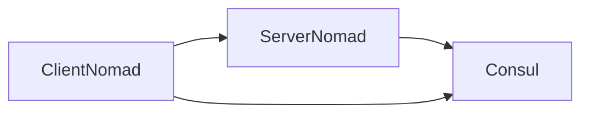

# Transparent proxy

In new update, Nomad is added new function for network. Transparent proxy is technology that 

# Scheme work

So start work You'll learn a scheme interaction services 


# Setting

## Server

Minimal hardware requirements:

- Servers: 2 cpu, 4 GB Memory
- Clients: 2-4 cpu, 4-8 GB Memory

## Ansible roles

Firstly, You download ansible roles [nomad](https://github.com/ansible-community/ansible-nomad) and [consul](https://github.com/ansible-collections/ansible-consul).

Next,  So You need to create playbook yaml for setting host, for example:
```yaml


```

When you set yaml you will buy 5 vps in any provider. As  an option you can registrate  in Google Cloud because you can use free plan for your tests.


## Consul

## Nomad 


# Tips

You can have some problems:
1) Servic don't have access dns;
2) Client can't access to nomad server

To solve a first problem You need to check ufw rules on host. For interaction dns, Network nomad  must access to dns

For solve a second problem, You need to check ufw rules to on host was opened ports: 8301 ....

# Conclusion

I think, This is big update that everyone will help modernazation interaction with nomad and consul.

